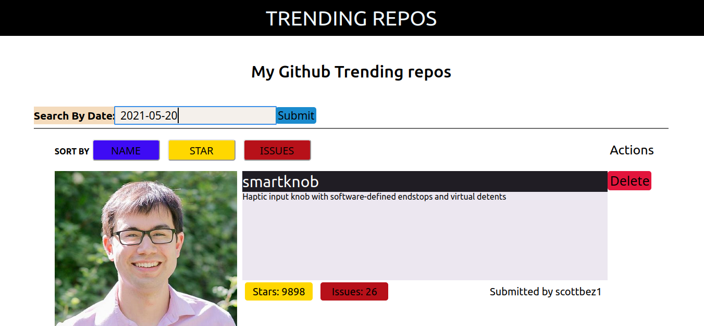

# Trending-Repos

Trending-Repos is a web app that allows users to search and lists the most starred Github 
repos. Trending-Repos gets data from the github api and shows the following fields listed
below.

- The app shows the following fields the display:
    - Repository name
    - Repository description.
    - Number of stars for the repo.
    - Number of issues for the repo.
    - Username and avatar of the repo owner.

## Live link

[live link](https://sheltered-beyond-61404.herokuapp.com/)

## Built With

- Javascript
- React
- Node
- JSX
- HTML
- CSS

## Screenshot

## Getting Started

To get a local copy up and running follow these simple example steps.

- Clone the repo by typing `git clone git@github.com:Oxford-G/trending-repos.git`
- cd into the root directory ` cd trending-repos`
- `npm install` - This will install all the packages in the package.json file

## Run locally

- `npm start` - This will run the app locally in the local environment
- Go to `https://localhost:3000/` on your browser
- Try it!!

## Run tests

- Go to your terminal
- Run `npm test` to run all the tests.

## Author

👤 **Enekwechi Chinonso Gerald**

- GitHub: [@Oxford-G](https://github.com/Oxford-G)
- Twitter: [@OXFORD2](https://twitter.com/OXFOXD2)
- Linkedin: [Enekwechi Chinonso G](https://www.linkedin.com/in/chinonso-enekwechi)

## 🤝 Contributing

Contributions, issues, and feature requests are welcome!

## Show your support

Give a ⭐️ if you like this project!
